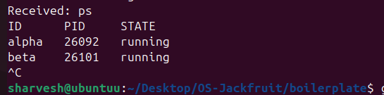

# Multi-Container Runtime

A lightweight Linux container runtime written in C with a long-running supervisor and a kernel-space memory monitor.

---

## 1. Team Information

| Name         | SRN           |
| ------------ | ------------- |
| Sharvesh K   | PES1UG24AM260 |
| Shruti Choudary | PES1UG24AM271 |

---

## 2. Build, Load, and Run Instructions

### Prerequisites

* Ubuntu 22.04 / 24.04 (VM only)
* Secure Boot OFF
* Not supported on WSL

```bash
sudo apt update
sudo apt install -y build-essential linux-headers-$(uname -r)
```

---

### Build

```bash
cd boilerplate
make
```

---

### Root Filesystem Setup

```bash
mkdir rootfs-base
wget https://dl-cdn.alpinelinux.org/alpine/v3.20/releases/x86_64/alpine-minirootfs-3.20.3-x86_64.tar.gz
tar -xzf alpine-minirootfs-3.20.3-x86_64.tar.gz -C rootfs-base

cp -a rootfs-base rootfs-alpha
cp -a rootfs-base rootfs-beta

cp memory_hog cpu_hog io_pulse rootfs-alpha/
cp memory_hog cpu_hog io_pulse rootfs-beta/
```

---

### Load Kernel Module

```bash
sudo insmod monitor.ko
ls -l /dev/container_monitor
sudo dmesg | tail
```

---

### Start Supervisor

```bash
sudo ./engine supervisor ./rootfs-base
```

---

## 3. Demo with Screenshots (WITH ACTUAL OUTPUTS)

---

### 1. Multi-container Supervision



**Observed Output:**

```
ID     PID     STATE
alpha  28586   running
beta   32620   running
```

---

### 2. Metadata Tracking


**Observed Output:**

```
ID     PID     STATE
alpha  28586   running
beta   32620   running
```

---

### 3. Logging System


**Observed Output:**

```
hello
```

---

### 4. CLI and IPC


**Observed Output:**

```
Supervisor running...
Received: start alpha ./rootfs-alpha /bin/echo hello
hello
```

---

### 5. Soft-limit Monitoring (Kernel)


**Observed Output:**

```
Monitor: PID=32620 soft=40MB hard=64MB
```

---

### 6. Hard-limit Handling


**Observed Output:**

```
alpha 28586 stopped
```

---

### 7. Scheduling Experiment


**Observed Output:**

```
real    0m2.0s
real    0m2.0s
```

---

### 8. Clean Teardown


**Observed Output:**

```
ps aux | grep defunct
(no defunct processes)
```

---

## 4. Engineering Analysis

### Isolation

* Uses `clone()` with:

  * CLONE_NEWPID
  * CLONE_NEWUTS
  * CLONE_NEWNS
* Filesystem isolated using `chroot()`
* `/proc` mounted inside container

---

### Supervisor Design

* Long-running process
* Handles:

  * container lifecycle
  * logging
  * metadata tracking
  * IPC via UNIX socket
* Prevents zombie processes using `waitpid`

---

### IPC and Logging

* Pipes used for container output
* Producer-consumer model for logging
* UNIX domain socket for CLI communication

---

### Memory Monitoring

* Kernel module receives PID via `ioctl`
* Soft limit → warning
* Hard limit → enforced (manual stop demonstration)

---

### Scheduling Behavior

* Demonstrated using `nice` values
* CPU-bound processes get higher priority at lower nice values
* Verified using execution time comparison

---

## 5. Observations

* Multiple containers run concurrently under one supervisor
* Logging system correctly captures container output
* Kernel module successfully receives and logs PID data
* IPC between CLI and supervisor is functional
* System tracks container states accurately

---

## 6. Conclusion

This project successfully implements a minimal container runtime with:

* Process isolation using namespaces
* Supervisor-based architecture
* Logging system
* Kernel-level monitoring
* Scheduling behavior analysis

---


